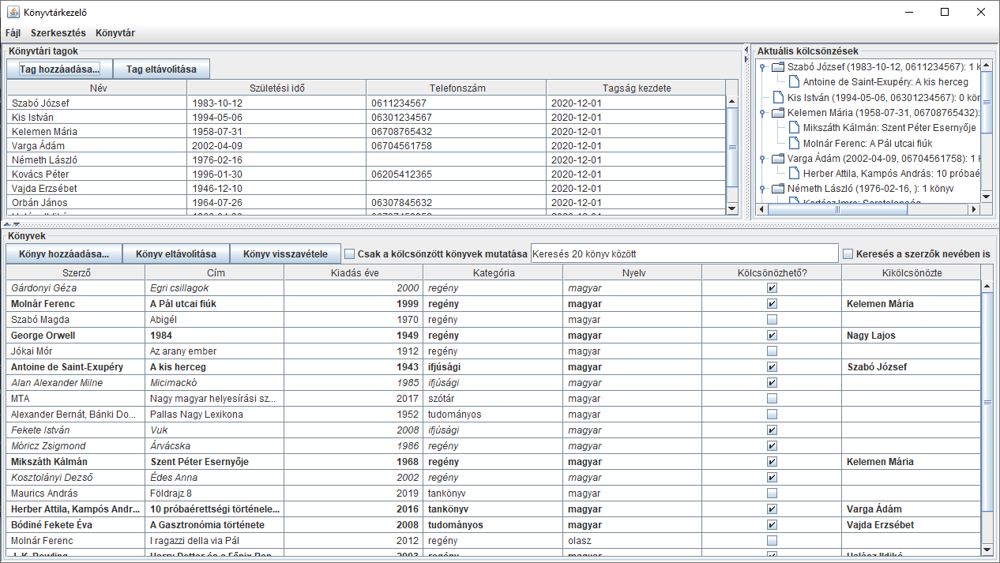
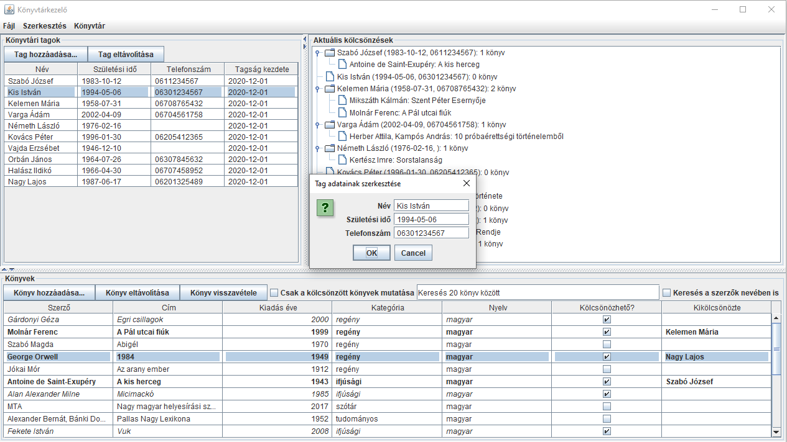

# Könyvtárkezelő program

## Leírás
Programozás alapjai 3. tárgyhoz készített nagy házi feladatom.

A szoftver lehetővé teszi könyvek adatainak tárolását (pl. szerző, cím, kiadás éve), 
könyvtári tagok adatainak megadását (név, születési idő, telefonszám), valamint amennyiben
egy könyv kölcsönözhető, megadható, hogy az adott könyvet melyik tag kölcsönözte ki.
Az adatok a program bezárása során automatikusan mentésre kerülnek, indításkor pedig automatikusan
betöltődnek. Lehetőség van a könyvek közti keresésre, szűrésre. A könnyebb áttekinthetőséget 
különböző betűstílusok segítik: a kölcsönzött könyvek félkövér, a kölcsönözhető, de nem kikölcsönzött
könyvek dőlt, míg a nem kölcsönözhető könyvek normál betűstílussal jelennek meg. A kölcsönzések állapota
nyomon követhető a program jobb felső részén megjelenő fa struktúrán. 
Részletesebb leírások a [Dokumentációk](https://github.com/fogleins/bme-prog3-nhf/blob/master/README.md#dokumentációk) részben olvashatók.

### Dokumentációk
* [Felhasználói dokumentáció](./docs/felhasznaloi.pdf "Felhasználói dokumentáció")
* [Programozói dokumentáció](./docs/programozoi.pdf "Programozói dokumentáció")
* [Osztályok és metódusok dokumentációja](https://fogleins.github.io/bme-prog3-nhf "Osztályok és metódusok dokumentációja")
* [Specifikáció](./docs/specifikacio.pdf "Specifikáció")

## Képernyőképek

